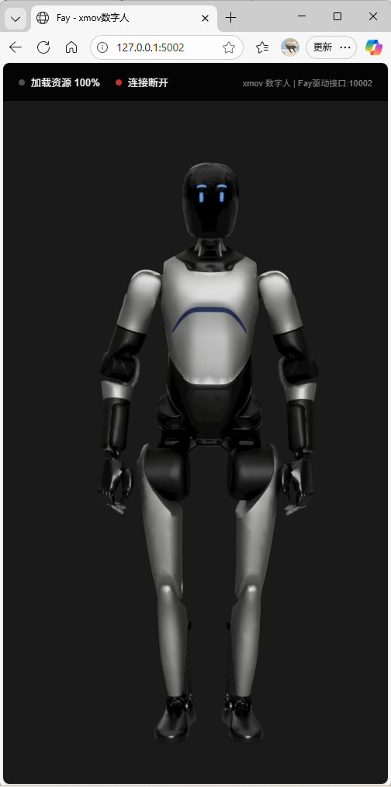

# xmov 数字人服务使用说明

## 概述

xmov SDK数字人服务是一个完全独立的服务，与 Fay（https://github.com/xszyou/Fay） 主应用解耦，可以独立部署和运行。


## xmovSDK获取([魔珐星云](https://c.c1nd.cn/9C9WW))
技术交流&&邀请码获取


## 架构说明

```
xmov 独立服务 (端口 5002)
    ↓
连接到 Fay WebSocket 服务 (端口 10002)
    ↓
接收数字人驱动数据
```

xmov 服务通过 WebSocket 连接到 Fay 的 10002 端口，接收数字人驱动数据。

## 配置

### 设置环境变量

xmov 服务仅从环境变量读取配置，不依赖任何配置文件。

#### Windows (永久设置 - 推荐)

```cmd
setx XMOV_APP_ID "your_app_id"
setx XMOV_APP_SECRET "your_app_secret"
```

**注意：** 使用 `setx` 后需要重启命令行窗口或应用程序才能生效。

#### Windows (临时设置 - 仅当前会话)

```cmd
set XMOV_APP_ID=your_app_id
set XMOV_APP_SECRET=your_app_secret
```

#### Linux/Mac

```bash
export XMOV_APP_ID=your_app_id
export XMOV_APP_SECRET=your_app_secret
```

### 获取 App ID 和 App Secret

在 [魔珐星云](https://xingyun3d.com/) 应用中心创建驱动应用后获取。

## 启动服务

### 方法1: 使用启动脚本（推荐）

```bash
python start_xmov.py
```

使用自定义端口:

```bash
python start_xmov.py 8080
```

### 方法2: 直接运行服务文件

```bash
python gui/xmov_server.py
```

## 访问服务

启动成功后，可以通过以下地址访问：

- **数字人页面:** http://localhost:5002/
- **配置API:** http://localhost:5002/api/xmov-config
- **健康检查:** http://localhost:5002/health

## 完整使用流程

### 1. 启动 Fay 主应用（如果需要与Fay交互）

```bash
python main.py
```

这将启动：
- Fay 主应用（端口 5000）
- WebSocket 服务（端口 10002）

### 2. 设置 xmov 环境变量

```cmd
setx XMOV_APP_ID "your_app_id"
setx XMOV_APP_SECRET "your_app_secret"
```

### 3. 启动 xmov 服务

```bash
python start_xmov.py
```

### 4. 访问数字人页面

在浏览器中打开: http://localhost:5002/

## 独立部署

xmov 服务可以独立部署在不同的服务器上：

1. **xmov 服务器**：运行 `start_xmov.py`，占用端口 5002
2. **Fay 服务器**：运行 `main.py`，提供 WebSocket 服务（端口 10002）
3. 在 `xmov_digital_human.html` 中配置 Fay 服务器的 WebSocket 地址

## 端口说明

| 服务 | 端口 | 说明 |
|------|------|------|
| Fay 主应用 | 5000 | Fay Web 控制台 |
| xmov 服务 | 5002 | xmov 数字人页面 |
| Fay WebSocket | 10002 | 数字人驱动数据通道 |

## 常见问题

### Q1: 启动时提示环境变量未设置

**A:** 请确保已正确设置环境变量，并且：
- 使用 `setx` 后重启了命令行窗口
- 或者在当前会话中使用 `set` 命令设置临时变量

### Q2: 数字人无法连接

**A:** 检查以下几点：
1. Fay 主应用是否正在运行（需要 WebSocket 服务）
2. 端口 10002 是否被占用
3. 浏览器控制台是否有 WebSocket 连接错误

### Q3: 能否不启动 Fay 主应用

**A:** 可以单独启动 xmov 服务查看页面，但无法接收数字人驱动数据。如果需要完整功能，必须同时运行 Fay 主应用。

### Q4: 如何修改端口

**A:** 启动时指定端口参数：

```bash
python start_xmov.py 8080
```

## 注意事项

1. ✅ xmov 服务与 Fay 主应用完全独立，互不影响
2. ✅ 环境变量必须正确设置，否则 xmov SDK 无法初始化
3. ✅ 可以在不同服务器上部署，只需确保网络连通
4. ⚠️ 修改环境变量后需要重启服务才能生效
5. ⚠️ 不要在配置文件中存储 App ID 和 Secret，仅使用环境变量

## 技术架构

```
┌──────────────────────────────────┐
│    xmov 独立服务 (端口 5002)      │
│  ┌────────────────────────────┐  │
│  │   Flask 应用               │  │
│  │  - 页面路由                │  │
│  │  - 配置API                 │  │
│  └────────────────────────────┘  │
│             ↓                     │
│  ┌────────────────────────────┐  │
│  │   环境变量                 │  │
│  │  - XMOV_APP_ID             │  │
│  │  - XMOV_APP_SECRET         │  │
│  └────────────────────────────┘  │
└──────────────────────────────────┘
            ↓ WebSocket
┌──────────────────────────────────┐
│  Fay WebSocket 服务 (端口 10002) │
│  - 发送数字人驱动数据             │
│  - IsFirst/IsEnd 流式标记         │
└──────────────────────────────────┘
```

## 文件说明

| 文件 | 说明 |
|------|------|
| `start_xmov.py` | xmov 服务启动脚本 |
| `gui/xmov_server.py` | xmov Flask 服务 |
| `gui/templates/xmov_digital_human.html` | 数字人页面模板 |

## 相关链接

- [魔珐星云](https://c.c1nd.cn/9C9WW) - 获取 App ID 和 Secret
- [Fay 项目](https://github.com/xszyou/fay) - Fay 数字人框架


